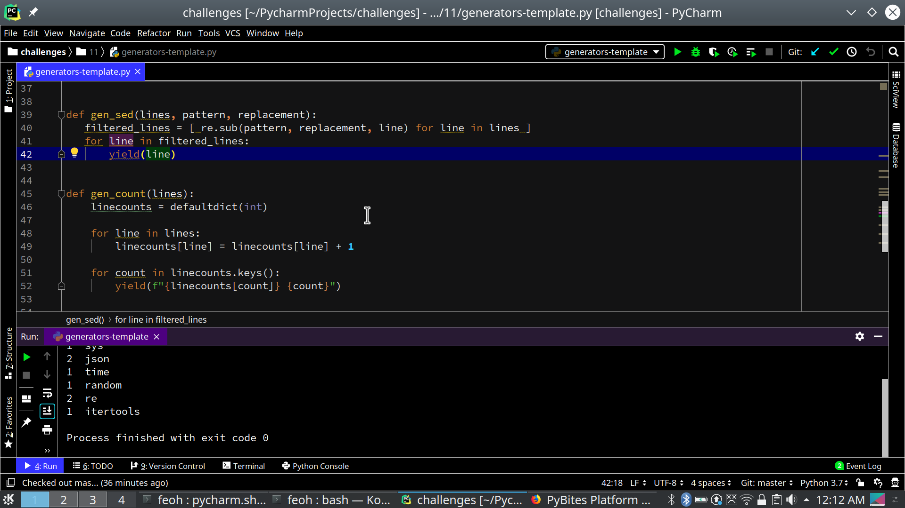

# 100 Days of Python / PyBites Code Challenge 11

This challenge was a great deal of fun. I've been slinging UNIX command lines for
30 years (Yes I'm old :) ) and as such dream in pipelines :)

So composing generators like this to create pipelines was a super cool idea that I found really inspirational and easy to get excited about.

Here's the screenshot: 