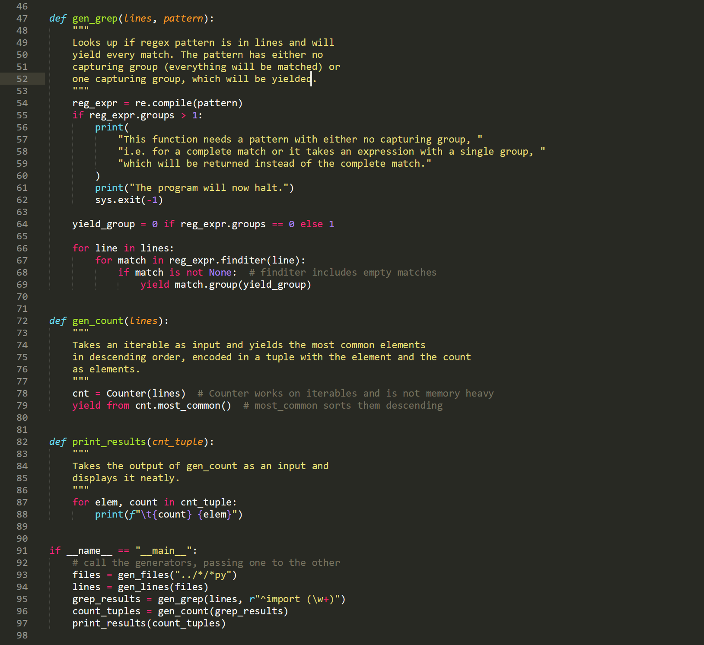

# Challenge 11

This challenge was a nice reminder to think about the memory footprint
of scripts. The generator is *great* way to process large amounts of
data iteratively. I used `pathlib` to have a neat cross-platform
script to grep through files, as I work on Windows and Linux it
is quite important for me. And I used the `yield from` statement
for the first time! Although, this the simplest use-case, I
haven't heard of it before starting the challenge.

I would appreciate any feedback. :)

