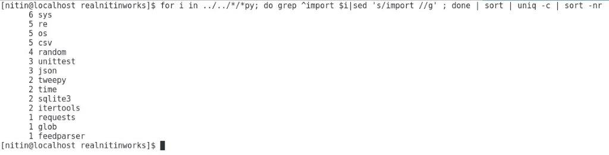
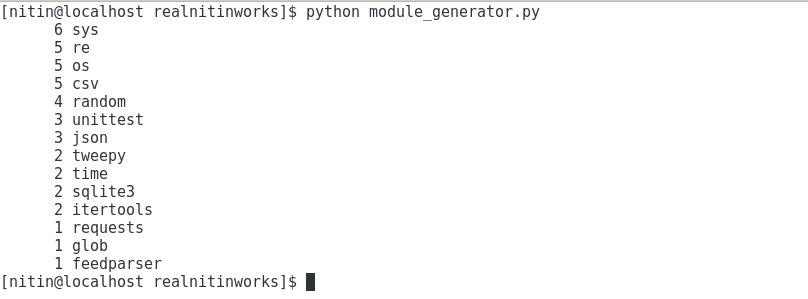

What does this program do?
---

The "module_generator.py" implements the shell pipeline for doing:

```
for i in ../*/*py; do grep ^import $i|sed 's/import //g' ; done | sort | uniq -c | sort -nr
```

This program uses the power of Python generators to achieve the same results of the shell 
pipeline

To run the program, do:
```
# python module_generator.py
```

Screenshots
---

- Output of shell pipeline




- Output of generator program



Conclusion
---

This program allowed me to understand the shell pipeline. Then using the power of Python
generators I was easily able to replicate the pipeline output. This challenge cemented the concepts
of generators and a few other gems in Python Standard Library.