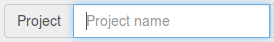
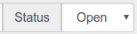

# Clamytoe's Task Manager App

## Index
* [Introduction](#introduction)
* [UI](#ui)
  * [New Project](#new-project)
  * [New Task](#new-task)
  * [Task Status](#task-status)
  * [Controls](#controls)
  * [Project Tabs](#project-tabs)
  * [Remove Project](#remove-project)
  * [Remove All Tasks](#remove-all-tasks)
  * [Status Toggle](#status-toggle)
  * [Remove Task](#remove-task)
* [Installation](#installation)

## Introduction
This a my submission to the PyBites Coding Challenge. 
It's a no frills task manager that's really intuitive and 
simple application to use.

#### UI

##### New Project

Enter the project name that you want to store your tasks
under.

##### New Task

Describe the task that you need to accomplish.

##### Task Status

The task can be entered as open or close.

##### Controls

Clicking on the **Add** button will add the new task and create
a new project if it does not already exist.

Clicking on the **Reset** button will reset the fields.

##### Project tabs

Any projects that are created will be displayed here in the
tab area. Clickin on the tab switches you to that project.

##### Remove Project

Clicking on this will remove the currently active project
along with all of it's corresponding tasks.

##### Remove all tasks

Clicking this will remove all tasks from the active project,
but leave the project active.

##### Status toggle

Clicking this will toggle the tasks from open to close.

##### Remove task

Clicking this will remove that tasks from the project.

## Installation
First of all you have to prepare your environment. Select
a location where you want to store the files. I will use 
Projects as my example. I'm also on a linux machine, but
you should be able to figure it out for any other platform.

    mkdir Projects
    cd Projects

Then follow along with the [INSTALL](https://github.com/pybites/challenges/blob/master/INSTALL.md)
instructions provided by [PyBites](http://pybit.es/) to
clone the challenges. Once cloned you can do the following:

    cd challenges/15/clamytoe
    python3 -m venv venv
    source venv/bin/activate
    pip install -r requirements.txt
    python app-clamytoe.py

Then simply open up a browser, Chrome/Chromium recommended,
to [localhost:5000](http://localhost:5000/) and play around
with it :).

