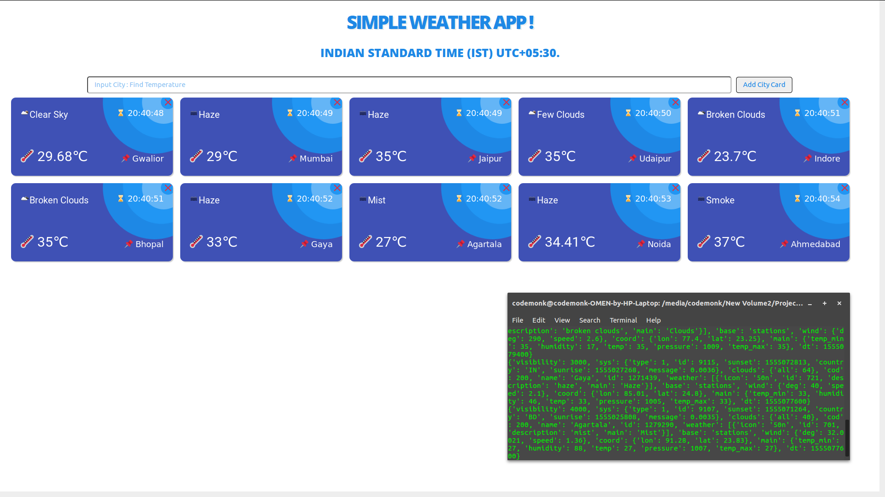
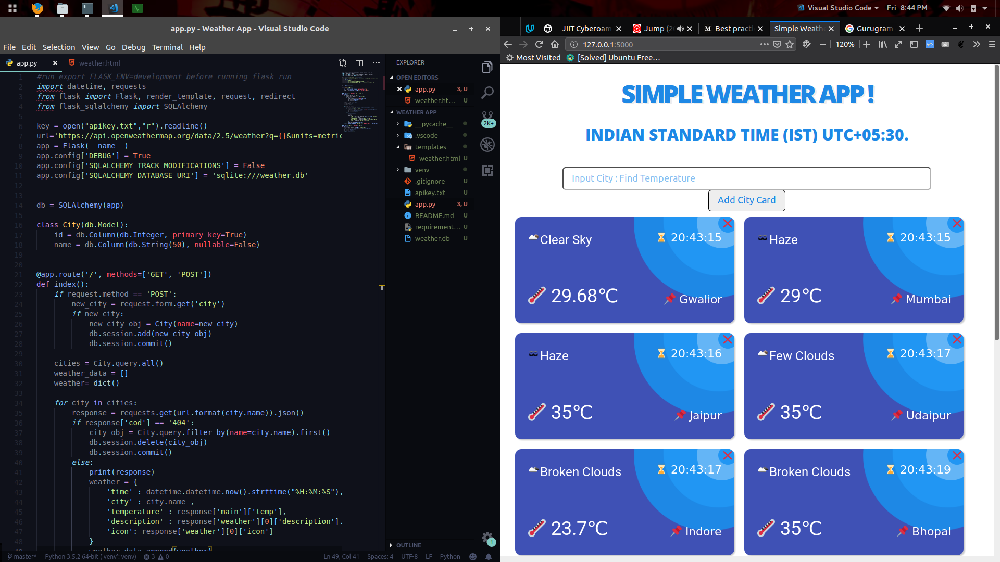

# Simple Weather App

> Implemented in Flask, Python3, It is a basic application which supports searching for cities worldwide and adding them as css cards showing their temperature and other details, It also supports deleting the cards.


I used weather data from Open Weather Map API

## Usage example

This application is really simple to use. Like any Flask **app**, you must start it like so:

```bash
export FLASK_ENV=development
flask run
```



## Meta

Mayank Singh – [Linkedin](https://www.linkedin.com/in/code-monk08/) – mayank.singh081997@gmail.com

Distributed under the MIT license. See ``LICENSE`` for more information.

[![License][license-image]][license-url]

[license-image]:https://img.shields.io/badge/license-MIT-blue.svg

[license-url]:https://raw.githubusercontent.com/clamytoe/pyTrack/master/LICENSE
