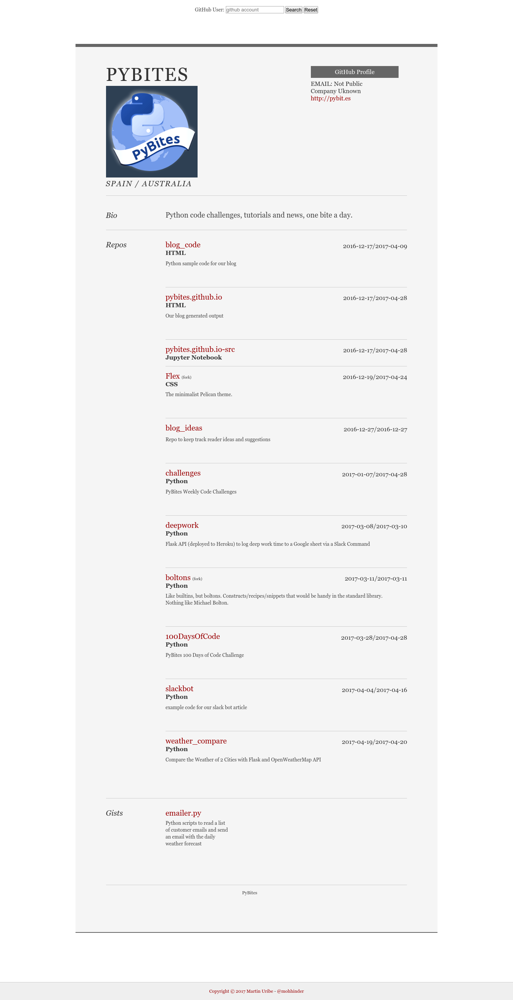

# GitHub Profiler

This Flask application will create a profile page for any valid GitHub user name that is entered into the form. It pulls the information through GitHub's API and displays it in a resume type format.

## Description
Currently it displays the following if it was made available:

* account name
* link to their GitHub page
* email address
* company
* blog/website
* repos
    * repo name
    * indicates if it's a fork
    * link to the repo
    * repo language
    * repo created date
    * repo last pushed date
    * repo description
* gists
    * gist name
    * link to the gist
    * gist description

Entry page:

Sample run for [pybites](https://github.com/pybites) account:

## Issues
Since there a lot of API calls being made in the background, initially on new searches it can take a few seconds. In order to alleviate this, the information is stored in a *sqlite3* database.

GitHub also limits the amount of API calls that can be made every hour to *60*. If you don't lookup more than one account per minute, you should be ok.

I've made my best to attempt to break the app and coded around those issues, but if you happen to find a bug, please let me know.

## Installation
To install the app and try it out yourself, do the following from the command line:

    cd <project-dir>
    git clone https://github.com/pybites/challenges
    cd challenges/16/clamytoe
    python3.6 -m venv venv
    source venv/bin/activate
    pip install -r requirements.txt
    python app.py

Now simply enter a GitHub user name into the input box and click on the *Search* button.

## ToDo
I'm still learning, so there are things that I had to do that I wasn't too happy with and some that I wish I had more time to add. Here's a list of some of the main ones:

* I would like to figure out how to retrieve a single column from a row in the database with *SQLAlchemy* instead of pulling all records and going through them all.
* I briefly thought about using [asyncio](https://docs.python.org/3/library/asyncio.html) for some of the API calls, but most of my calls are dependent upon the results of a previous one, so it wouldn't be too helpful.
* Make a more professional looking front page. I went with just the plain form for speed.
* Originally intended to add smaller images from the people that the account follows along with links to their accounts as profile lookups, but didn't do it because of how long the page was already taking to load.
