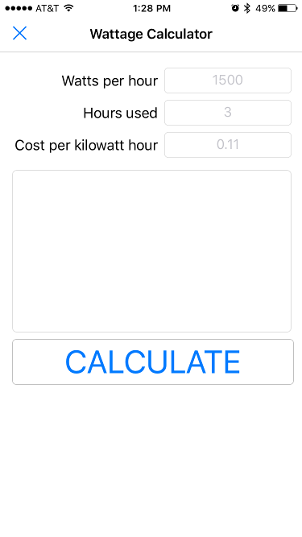
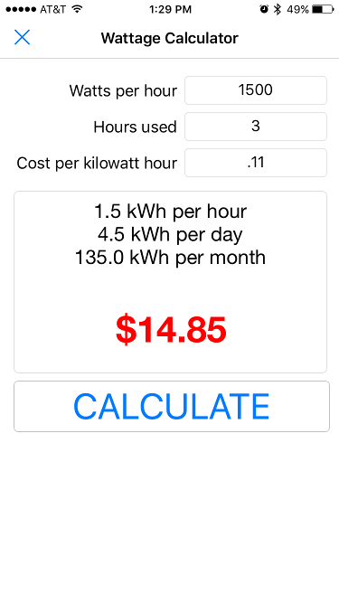

# Wattage Calculator
> Pythonista 3 app that allows you to quickly figure out how much you are spending per month on any given electronic device.

[![GitHub issues][issues-image]][issues-url]
[![GitHub forks][fork-image]][fork-url]
[![GitHub Stars][stars-image]][stars-url]
[![License][license-image]][license-url]
[![Twitter][twitter-image]][twitter-url]

Since not everyone has an iPhone and Pythonista 3 isn't free, here are some screenshots of it.

## Installation

Easiest way would be to navigate to the [github repo page](https://github.com/clamytoe/Wattage-Calculator) and copy the source code and paste it into a new file. Apple doesn't make it easy to import scripts. You could also, write your own script within Pythonista to download the files, which might be a better option, just not as easy.

## Usage example

The application is pretty intuitive. You simply enter how many watts your appliance uses and how many hours per day you have it turned on. Then if you look at your electric bill, you can see how much you are paying for each kilowatt hour. You enter that amount into the *Cost per killowatt hour* field.

## Release History

* 0.1.0
    * The first proper release

## Meta

Martin Uribe – [@mohhinder](https://twitter.com/mohhinder) – mohhinder@gmail.com

Distributed under the MIT license. See ``LICENSE`` for more information.

[https://github.com/clamytoe/Wattage-Calculator](https://github.com/clamytoe/Wattage-Calculator)

[issues-image]:https://img.shields.io/github/issues/clamytoe/Wattage-Calculator.svg
[issues-url]:https://github.com/clamytoe/Wattage-Calculator/issues
[fork-image]:https://img.shields.io/github/forks/clamytoe/Wattage-Calculator.svg
[fork-url]:https://github.com/clamytoe/Wattage-Calculator/network
[stars-image]:https://img.shields.io/github/stars/clamytoe/Wattage-Calculator.svg
[stars-url]:https://github.com/clamytoe/Wattage-Calculator/stargazers
[license-image]:https://img.shields.io/badge/license-MIT-blue.svg
[license-url]:https://raw.githubusercontent.com/clamytoe/Wattage-Calculator/master/LICENSE
[twitter-image]:https://img.shields.io/twitter/url/https/github.com/clamytoe/Wattage-Calculator.svg?style=social
[twitter-url]:https://twitter.com/intent/tweet?text=Wow:&url=%5Bobject%20Object%5D
