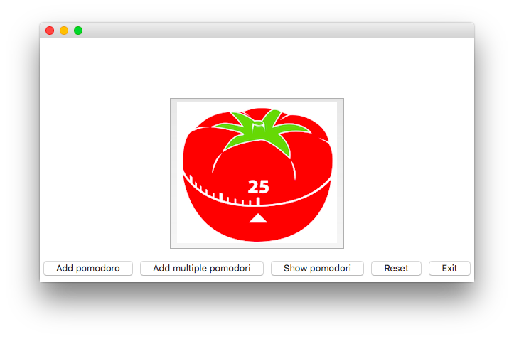

## Reading Progress Pomodori Tracker GUI

Idea from [How to Read More](https://kimschlesinger.com/blog/read-more.html) (Tracker printscreen at the bottom).

The idea is to track a weekly reading goal, but the app is Pomodori-generic so you can use it to track anything really.  

If not familiar with the Pomodoro Technique, checkout [this wiki](https://en.wikipedia.org/wiki/Pomodoro_Technique).

Let's adapt the goal of mentioned article: read at least 7 x 25 min or ~3 hours each week.

### Setup 

Make a virtualenv and install packages:

	$ python3 -m venv venv && source venv/bin/activate
	$ pip install -r requirements.txt

This app uses:

- [easygui](http://pythonhosted.org/easygui/): a nice and easy wrapper around Tkinter. 

- [matplotlib](http://matplotlib.org) to build a bar chart png on demand.

- You also want to install [Pillow](https://pillow.readthedocs.io/en/4.2.x/) so *easygui* can work with png files.

### How it works

* Assuming Mac I added `pomodoro.command` to launch the app from Finder. You can click it, or just run it from your terminal:

		$ source venv/bin/activate
		$ python pomodoro.py

* You get to the main GUI screen:

	

	Here you can add one or multiple pomodori. They are saved in a SQLite DB in the same folder as the code. Keeping it simple: the DB has one *logs* table with two columns: date (datetime) and pomodori (integer).

* When you hit 'Show pomodori' you see your performance. Under the hood it queries the DB and uses matplotlib to build a bar chart. The bars per week are red or green depending the performance against the target. Note I added some fake data running the script with `-f`:

	

* On the main screen, 'Add pomodoro' adds one unit (25 min), no questions asked. 'Add multiple pomodori' lets you add 1-5 pomodori at once. Let's demo that here:

	

	This adds the selected *int* pomodori to the DB's logs table.

* Now the bar is green because I read 8 pomodori (> target of 7):

	
