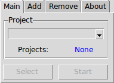
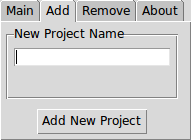
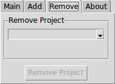
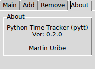

# pyTrack

> Simple project/task time tracker for Python 3.

[![GitHub issues][issues-image]][issues-url]
[![GitHub forks][fork-image]][fork-url]
[![GitHub Stars][stars-image]][stars-url]
[![License][license-image]][license-url]
[![Twitter][twitter-image]][twitter-url]

Helps you keep track of how much time you spend on your projects and tasks. A sqlite database is used to track your time logs, and it is kept simple by only implementing as few commands as needed to get a full featured application. You can add/remove multiple projects, start/stop tracking any of them, or completely reset the database to start with a clean slate.

## Installation

OS X & Linux:

```bash
cd
mkdir Projects
cd Projects
git clone https://github.com/clamytoe/pyTrack.git
python3.6 -m venv venv
source ./venv/bin/activate
pip install .
```

These are all of the packages that get installed:

```bash
pip freeze
click==6.7
dateparser==0.6.0
humanize==0.5.1
maya==0.3.2
peewee==2.10.1
pendulum==1.2.4
python-dateutil==2.6.0
pyTrack==0.1.2
pytz==2017.2
pytzdata==2017.2
regex==2017.6.23
ruamel.yaml==0.15.15
six==1.10.0
tzlocal==1.4
```

## Uninstall

Uninstalling the package is very simple.

```bash
pip uninstall pytrack
```

## Usage example

This application is really simple to use. To get help simply add *--help* as an argument. Each command can additionally provide more help information if you add *--help* behind it.

```bash
pytrack --help
Usage: pytrack [OPTIONS] COMMAND [ARGS]...

Options:
  --help  Show this message and exit.

Commands:
  add     Add a new project
  gui     Start the program with a gui front end
  remove  Remove the project by the entered ID
  reset   Reset the database
  select  Marks the given project ID as selected
  start   Starts active tracking of project
  stop    Stops active tracking of project
```

### List all projects

To list all of the projects that you are currently tracking:

```bash
pytrack
 [1] 0:00:00 INACTIVE: Put together a README.md file
*[2] 0:36:02 INACTIVE: Create setup.py
```

> NOTE: If you don't currently have any projects in the database, the program will let you know that.

The project marked with an ``*`` is the currently selected project. This means that the **start** and **stop** commands will apply to that project.

### Add a new project

To add a new project use the **add** command followed by the name of your project. If longer than one word, enclose it in quotes.

```bash
pytrack add "Replace the motor on the A/C unit"
Added Project: [3] Replace the motor on the A/C unit
Selected: [3] Replace the motor on the A/C unit
```

The project is added and selected as the default project.

### GUI
Just what the command implies. If you would prefer to use the GUI start it as so:

```bash
pytrack gui
```

It has four tabs: 

#### Main


#### Add


#### Remove


#### About


Through it, you can do pretty much everything that you can do through the command line except for clearing the database.
You'll have to do it a project at a time.

### Remove a project

To remove a project use the **remove** command followed by the project id.

> NOTE: To get the project id, just run **pytrack** by itself.

```bash
pytrack remove 3
About to remove [3] Replace the motor on the A/C unit
Are you sure (y/n): y
Removed [3] Replace the motor on the A/C unit
```

You are asked to confirm your action and a confirmation message is displayed.

### Select a project

To switch the default project, use the **select** command.

```bash
pytrack select 1
Selected: [1] Put together a README.md file
```

### Start tracking the currently selected project

If you are ready to work on a project that you want to track, simply issue the **start** command to start tracking it.

```bash
pytrack start
Activating: Put together a README.md file
```

You are now tracking this project. You can run **pytrack** by itself to confirm that the project is now *ACTIVE*.

```bash
pytrack
*[1] 0:00:00 ACTIVE: Put together a README.md file
 [2] 0:36:02 INACTIVE: Create setup.py
```

### Stop tracking the currently ACTIVE project

When you are finished or are read to take a break simply run the **stop** command.

```bash
pytrack stop
Deactivating: Put together a README.md file with total time of 0:05:08
```

You will be given a summary of how long you have been working on the project. This will also be updated in the project listing.

```bash
pytrack
*[1] 0:05:08 INACTIVE: Put together a README.md file
 [2] 0:36:02 INACTIVE: Create setup.py
```

The default project will remain selected until you add a new project or you change it yourself. When you are ready to start working on the project again, just use the **start** command once again. When this run is stopped, the accumulated times of all runs will be summarized in the project listing.

> NOTE: Feel free to take as many breaks as needed, you can always start tracking once again at any time.

### Reset the database

If you have completed all of your projects and you want to start with a clean slate so that your new projects don't start at the last created project id, simply **reset** the database.

```bash
pytrack reset
WARNING: You are about to delete all records!
Are you sure (y/n/): y
All records have been removed.
```

> WARNING: This is unrecoverable! Make sure that you truly want to delete all logs!

## TODO

* I plan on adding an option to output the logs into a csv file.

## Development setup

If you would like to install this in order to play around with the code and make modifications yourself, simply change the last command in the installation instructions above to the following:

```bash
pip install -e .
```

## Release History

* 0.2.0
    * ADDED: Added a GUI interface to the project.
    * CHANGE: Changed some code so that it would work with the GUI.
* 0.1.2
    * CHANGE: Modified to use pip to install the package.
* 0.1.1
    * CHANGE: Modified imports to utilize namespaces properly.
* 0.1.0
    * CHANGE: Moved the database file into the home directory of the user because when installed, the database was getting created from wherever the command was being issued.
    * CHANGE: Renamed the database file.
* 0.0.6
    * CHANGE: Removed all f-strings so that the code could be used in older versions of Python.
* 0.0.5
    * FIX: Fixed bug when the currently selected project is removed, no other is selected as the default.
* 0.0.4
    * CHANGE: Refactored into a package
    * ADD: Added setup.py, README.md, and LICENSE
* 0.0.3
    * ADD: Added PeeWee backend
    * ADD: Started using Maya for datetime objects
* 0.0.2
    * The first true commandline version
    * CHANGE: Modified into a commandline utility
    * ADD: Started using click
* 0.0.1
    * Work in progress

## Meta

Martin Uribe – [@mohhinder](https://twitter.com/mohhinder) – clamytoe@gmail.com

Distributed under the MIT license. See ``LICENSE`` for more information.

[https://github.com/clamytoe/pyTrack](https://github.com/clamytoe/pyTrack)

[issues-image]:https://img.shields.io/github/issues/clamytoe/pyTrack.svg
[issues-url]:https://github.com/clamytoe/pyTrack/issues
[fork-image]:https://img.shields.io/github/forks/clamytoe/pyTrack.svg
[fork-url]:https://github.com/clamytoe/pyTrack/network
[stars-image]:https://img.shields.io/github/stars/clamytoe/pyTrack.svg
[stars-url]:https://github.com/clamytoe/pyTrack/stargazers
[license-image]:https://img.shields.io/badge/license-MIT-blue.svg
[license-url]:https://raw.githubusercontent.com/clamytoe/pyTrack/master/LICENSE
[twitter-image]:https://img.shields.io/twitter/url/https/github.com/clamytoe/pyTrack.svg?style=social
[twitter-url]:https://twitter.com/intent/tweet?text=Wow:&url=%5Bobject%20Object%5D
