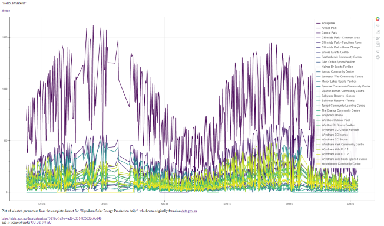

17 May 2020 A. McElroy (alcognito)

## Integrate a Bokeh Chart Into Flask & Deploy (to Heroku)
https://codechalleng.es/challenges/28/

This implementation uses public data from [data.gov.au](https://data.gov.au/data/dataset/aa75879c-1d3e-4ad2-b331-826032c6b84b) for the Wydnham Wind Farm Scheme - which I have successfully deployed to [Heroku](https://pcc28.herokuapp.com/)

Pre-requisites: 
--
>Create a directory 
Clone the git repository  
Create a virtual environment based on Python 3 and activate it 
pip install -r requirements.txt 

Then execute 'python app.py' in the terminal

### Landing Page & Plot Page
On successful start of the server, the initial landing page has a link to a plot based on the Wyndham Wind Farm data.
This data is retrieved from the source each time the webpage is loaded.

### ***Data plot***

 

## Additional Notes

The instructions point to a flask-bokeh tutorial from July 2017.
This uses flask==0.12.2 and bokeh==0.12.6
(https://github.com/realpython/flask-bokeh-example/blob/master/tutorial.md)

I used the latest available versions of flask(==1.1.2) & bokeh(==2.0.2)
I had to make some minor changes to the code as per the notes included below
as encode_utf8 was removed from bokeh==2.0.0

### Particular lessons learned 
- Data response/processing speed was an issue (solved). Using json.loads(r.text) is ***significantly*** slower than using the r.json() method
- There are several standard Bokeh palettes - these have limited numbers of colours. I was able to overcome this limitation by using the `linear_palettes` module.
