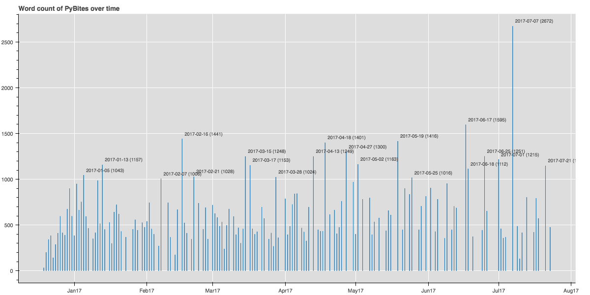

## PyBites Code Challenge 28 - Bokeh + Flask

Ideas: PyBites post wordcount over time and/or doing funky visualizations on [our movie data set of challenge 13](https://github.com/pybites/challenges/tree/master/13).

Time only allowed for former, latter to be done ... (exciting!)

### What I did so far

1. I added some code in `get_data.py` to download our complete [PyBites repo](https://github.com/pybites/pybites.github.io-src).

2. I used [Real Python's starter code](https://github.com/realpython/flask-bokeh-example/blob/master/tutorial.md) to get started - very helpful.

3. I added labels which was a bit of a challenge (`from bokeh.models import ColumnDataSource, LabelSet`)

### Saved plot

### TODOs

4. Add a GET parameter to the Flask route to refresh the GH clone of the repo.

5. Deploy to Heroku using [Julian's tutorial](https://pybit.es/deploy-flask-heroku.html).
