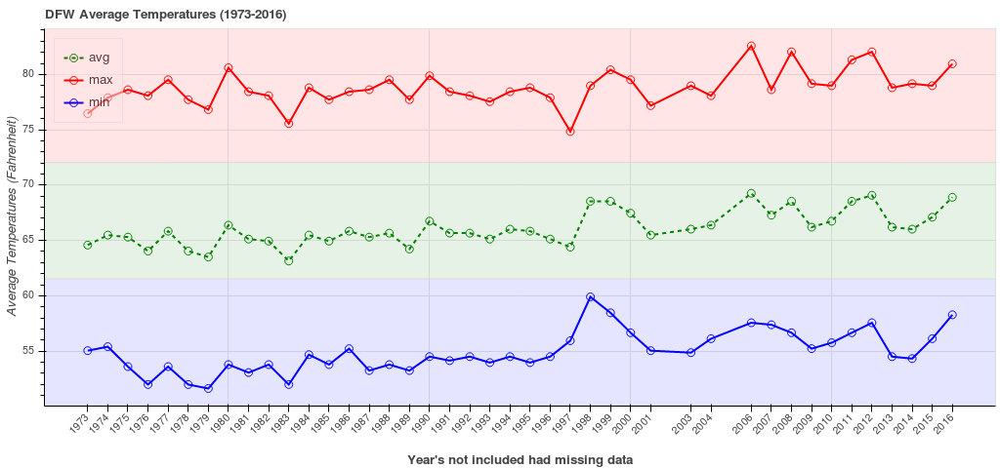

# PCC28 - Boken & Flask

> My Pybites challenge 28 entry for Bokeh and Flask integration.

[![License][license-image]][license-url]

For this challenge I've started using Anaconda with Python 3.6.1. I didn't use any code exclusive to 3.6 so this should run on any version of Python from 2.7 and up.

I used weather data for the Dallas/Fort Worth area from [tutiempo.net](https://en.tutiempo.net/climate/ws-722590.html). It displays the average minimum, maximum, and just plain average temperatures from 1973 to 2016. There were some incomplete datasets, so I simple ignored those.

## How to run

OS X & Linux:

```bash
cd
mkdir Projects
cd Projects
git clone https://github.com/clamytoe/bokeh-flask.git
cd bokeh-flask
python3.6 -m venv venv
source ./venv/bin/activate
pip install -r requirements.txt
```

These are all of the packages that get installed:

```bash
beautifulsoup4==4.6.0
bkcharts==0.2
bokeh==0.12.6
click==6.7
Flask==0.12.2
html5lib==0.999
itsdangerous==0.24
Jinja2==2.9.6
lxml==3.8.0
MarkupSafe==0.23
numpy==1.13.1
pandas==0.20.2
python-dateutil==2.6.0
pytz==2017.2
PyYAML==3.12
requests==2.14.2
six==1.10.0
tornado==4.5.1
Werkzeug==0.12.2
```

## Uninstall

Removing the files is very simple, just delete the folder where you cloned the repo to.

## Usage example

This application is really simple to use. Like any Flask **app**, you must start it like so:

```bash
python app.py
```


## Meta

Martin Uribe – [@mohhinder](https://twitter.com/mohhinder) – clamytoe@gmail.com

Distributed under the MIT license. See ``LICENSE`` for more information.

[license-image]:https://img.shields.io/badge/license-MIT-blue.svg
[license-url]:https://raw.githubusercontent.com/clamytoe/pyTrack/master/LICENSE
