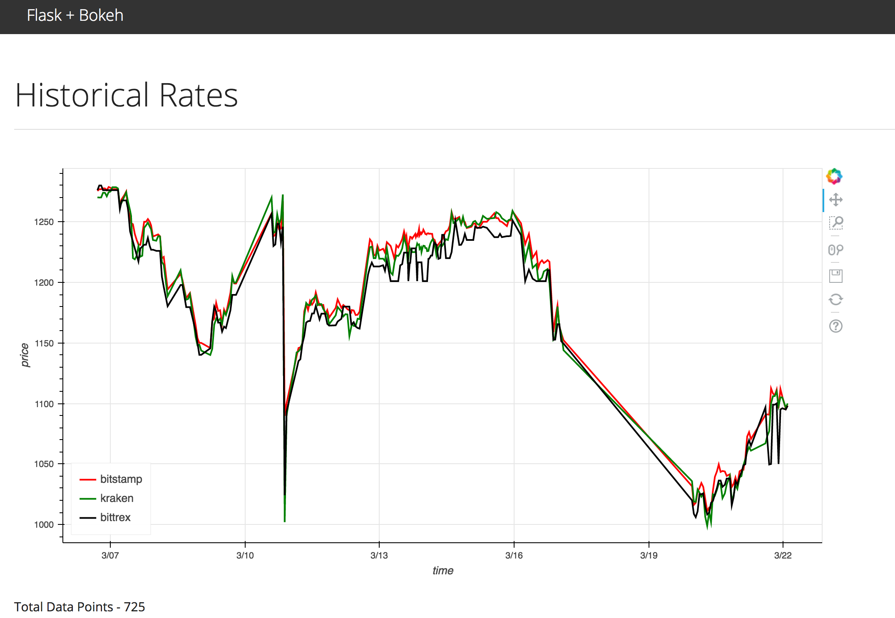

# PyBites Code Challenge 28 - Bokeh + Flask

App that displays the historical exchange rates for Bitcoin (USD -> Bitcoin) from the following cryptocurrency exchanges:

1. [Bitstamp](https://www.bitstamp.net/)
1. [YoBit](https://yobit.net/)
1. [Bittrex](https://bittrex.com/)



## Quick Start

### Basics

1. Create and activate a virtualenv
1. Install the requirements

### Set Environment Variables

Update *project/server/config.py*, and then run:

```sh
$ export APP_SETTINGS="project.server.config.DevelopmentConfig"
```

or

```sh
$ export APP_SETTINGS="project.server.config.ProductionConfig"
```

### Create DB

Create the db within psql:

```sh
# CREATE DATABASE flask_bokeh;
```

Then apply the schema:

```sh
$ python manage.py create_db
```

Load data:

```sh
$ psql -h localhost -p 5432 -d flask_bokeh -f ./data.sql
```

### Run the Application

```sh
$ python manage.py runserver
```

Access the application at the address [http://localhost:5000/](http://localhost:5000/)

> Want to specify a different port?

> ```sh
> $ python manage.py runserver -h 0.0.0.0 -p 8080
> ```

### Test

```sh
$ python manage.py test
```
