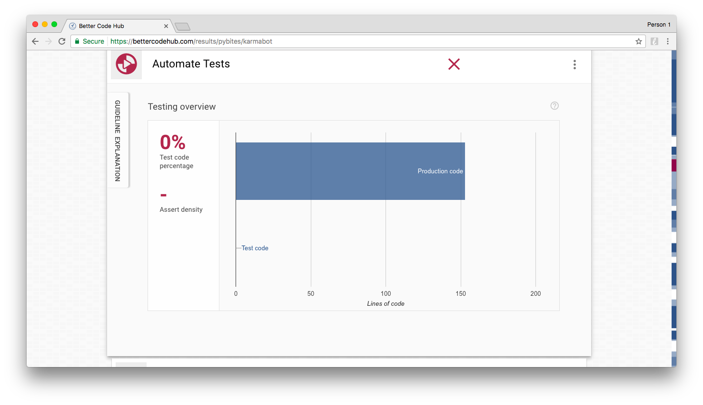
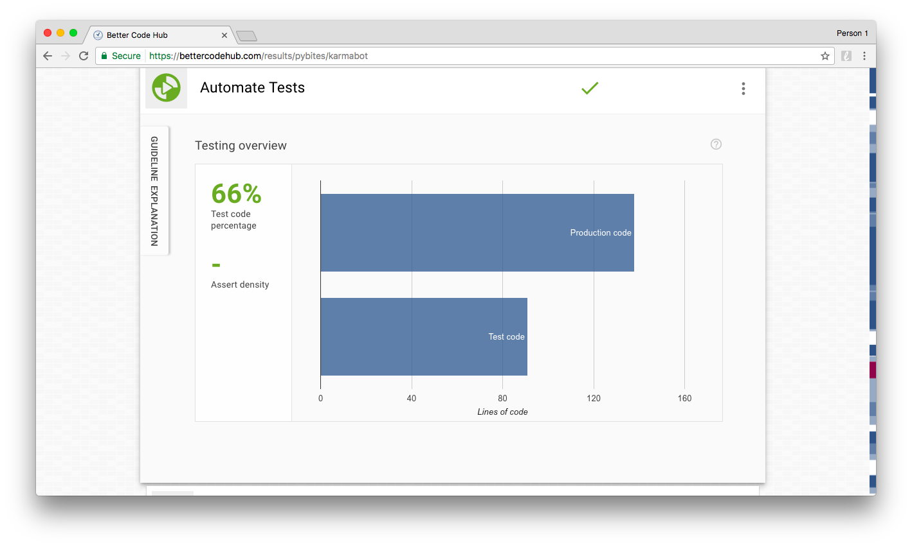
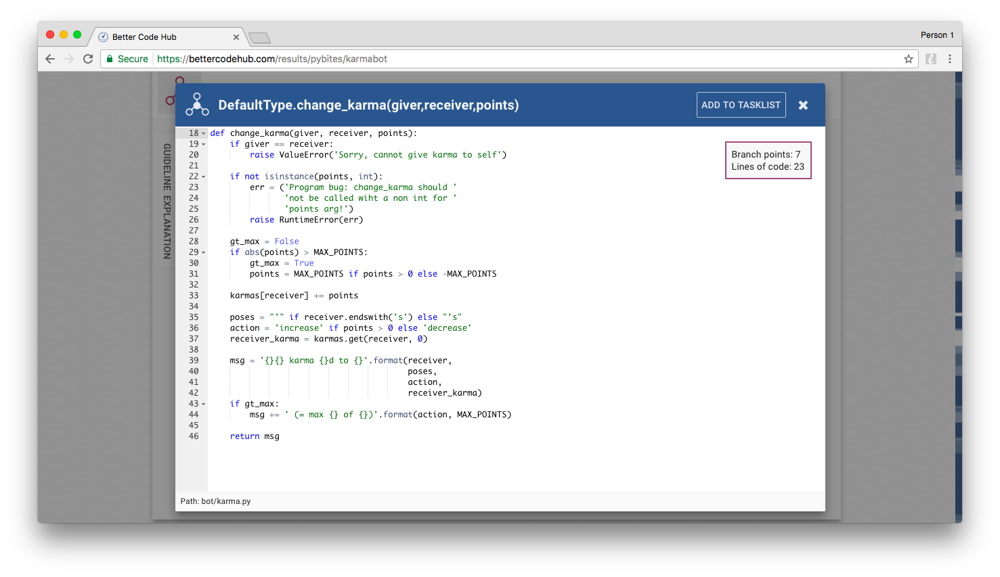
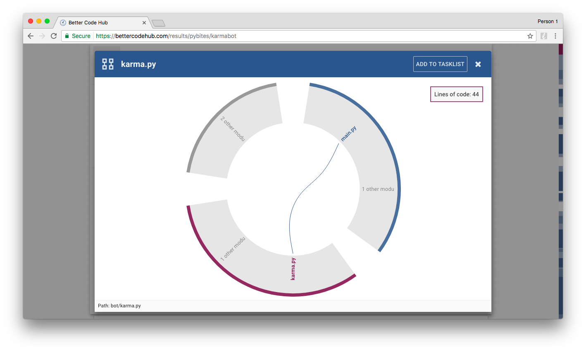
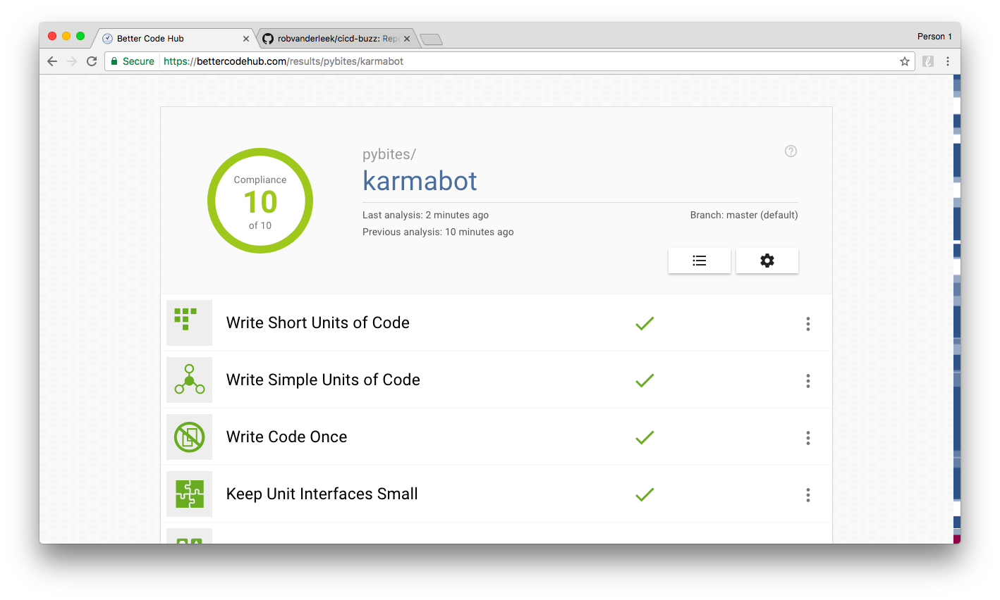
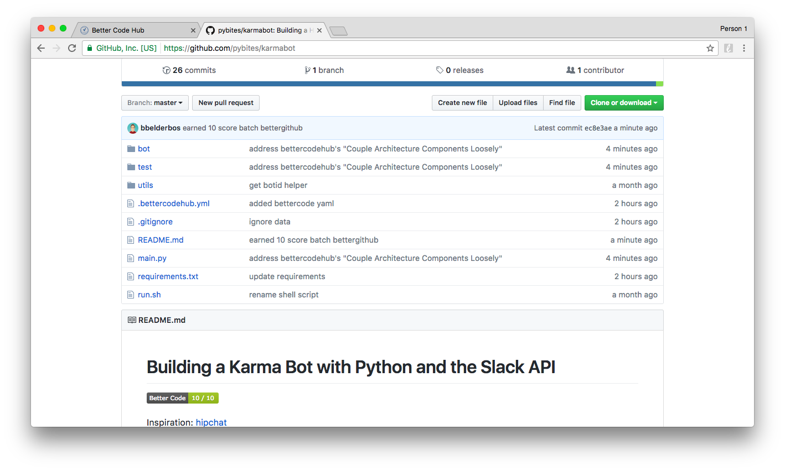

## PyBites Code Challenge 30 - The Art of Refactoring: Improve Your Code

### Background

At first I wanted to work on an old un-Pythonic script. Problem was: it would have been easy and some scripts are better dead and buried. 

So I thought: 

> Let's do something real, something that we use and has to be mainained! 

Hence I decided to use this challenge to refactor our [Karmabot](https://github.com/pybites/karmabot). 

> Heck, why not make it more robust now?! (Zen of Python: Now is better than never.)

It scored a meager 6 on [Better Code Hub](https://bettercodehub.com) (What is that? Keep reading ...), hence it could use some work ...

### Approach

1. First I added unittests to have a regression suite (normally we need functional tests as well). 

	Dealing with an external API (Slack) made this a challenge on its own, but luckily [this awesome RealPython article](https://realpython.com/blog/python/testing-third-party-apis-with-mocks/) made it relatively easy.

2. Then I thought this would be the perfect occasion to give [SIG](https://www.sig.eu/)'s [Better Code Hub](https://bettercodehub.com) another try. Its guidance and rich UI made it a joyful experience. I refactored more than I anticipated making the solution leaner and better maintainable. To read more about the 10 software quality guidelines they check, I can highly recommend [their book](https://www.amazon.es/dp/B01B6WS86I?ref_=cm_sw_r_kb_dp_IjQ3wb0SZJMN1&tag=bobbeld-20&linkCode=kpe). I reviewed / digested it [here](https://bobbelderbos.com/2016/03/building-maintainable-software/).

3. You can see the refactorings in the [commit history](https://github.com/pybites/karmabot/commits/master). They could have been more granular, but I will follow up with a more detailed blog post about what I did and how [Better Code Hub](https://bettercodehub.com) helped me ...

### Some more screenshots

Oh oh ...

That's better:

Sure the formatting looks nice but various issues here: number of branch points, 3 method (interface) params and one method doing multiple things. This example led to various refactorings even changing part of the karma module into a class.

When I thought I was done BCH still pointed out I should "Couple Architecture Components Loosely". It turned out main.py and karma.py were too intertwined:

And the final result:

Very cool you can add SIG's Better Code badge to your GH Project's Readme:

