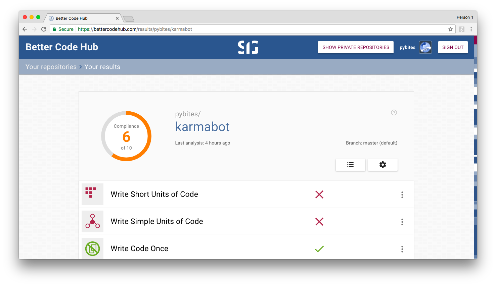

## PyBites Code Challenge 30 - The Art of Refactoring: Improve Your Code

### Background

At first I wanted to work on an old un-Pythonic script. Problem was: it would have been easy and some scripts are better dead and burried. 

So I thought: 

> No, let's do something real, something that we use and has to be mainained, so why not make it more robust now?!

Hence I decided to use this challenge to refactor our [Karmabot](https://github.com/pybites/karmabot). 

It scored a meager 6 on [Better Code Hub](https://bettercodehub.com) (keep reading ...), hence it needed some work ...

### Steps

1. First I added unittests to have a regression suite (normally we need FT as well!). Dealing with an external API (Slack) made this a challenge on its own, but luckily [this awesome RealPython](https://realpython.com/blog/python/testing-third-party-apis-with-mocks/) made it relatively easy.

2. Then I thought this would be the perfect occasion to give [SIG](https://www.sig.eu/)'s [Better Code Hub](https://bettercodehub.com) another try. Its guidance and rich UI made it a joyful experience. I refactored more than I anticipated making the solution leaner and better maintainable. To read more about the 10 software quality guidelines this platform checks read [their book](https://www.amazon.es/dp/B01B6WS86I?ref_=cm_sw_r_kb_dp_IjQ3wb0SZJMN1&tag=bobbeld-20&linkCode=kpe) and/or [my digest of it](https://bobbelderbos.com/2016/03/building-maintainable-software/).

3. You can see the refactorings in the [commit history](https://github.com/pybites/karmabot/commits/master). They could have been more granular, but I will follow up with a more detailed blog post about what I did and how [Better Code Hub](https://bettercodehub.com) helped me (probably on my blog: [bobcodes.it](https://bobcodes.it) ...)

### Some more screenshots

Oh oh ...

That's better:

Sure the formatting looks nice but the number of branch points, method params and doing > 1 thing led to various refactorings. I even ended up wrapping this in a class!

Refactorings - BCH recommended to "Couple Architecture Components Loosely":

I made quite a few refactorings leading to more maintainable code:

Very cool you can add SIG's Better Code badge to your GH Project's Readme:

