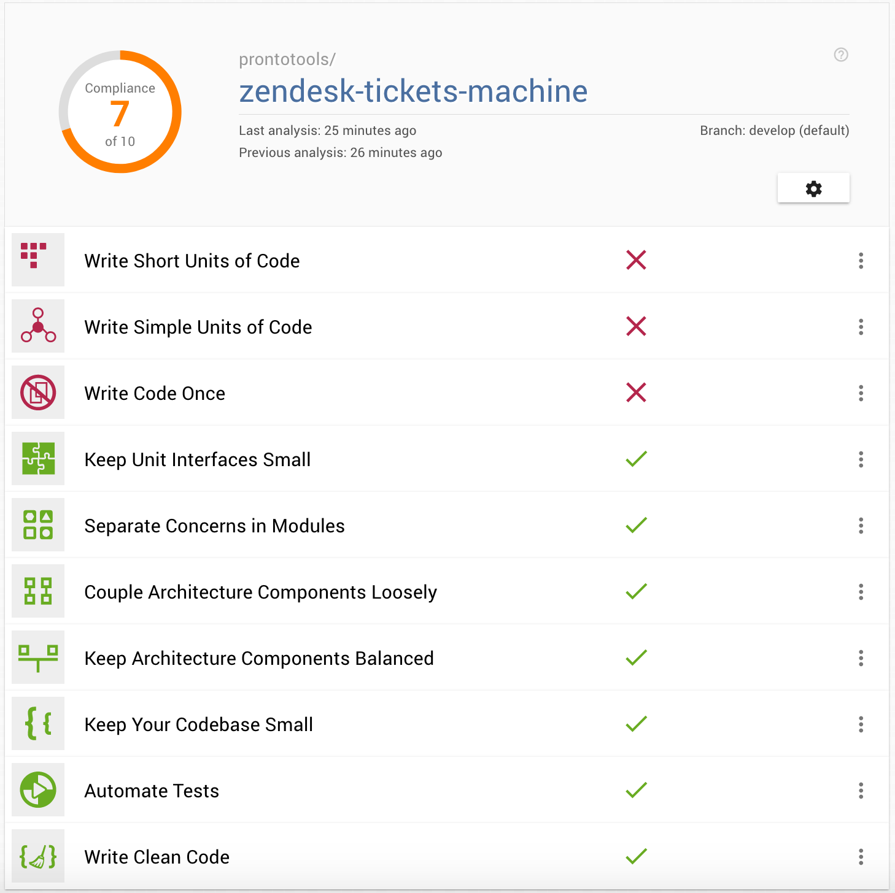
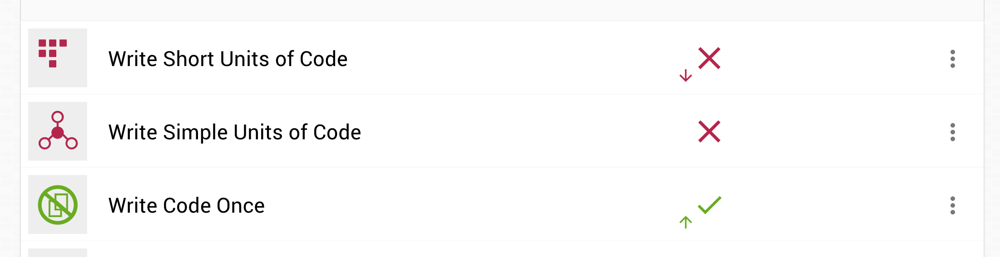

## PyBites Code Challenge 30 - The Art of Refactoring: Improve Your Code

For this challenge, I decide to work on the existing open-source project called [Zendesk Tickets Machine](https://github.com/prontotools/zendesk-tickets-machine). It's an internal tool we use to create Zendesk tickets from our data template. This project was born on Dec 9, 2016, so it's 2 years old now during the time I write this readme. There's still room for improvement.

### Progress
- https://github.com/prontotools/zendesk-tickets-machine/pull/113
- https://github.com/prontotools/zendesk-tickets-machine/pull/114
- https://github.com/prontotools/zendesk-tickets-machine/pull/115

### Some Screenshots from Better Code Hub

Before refactoring..

After remove duplicates..

