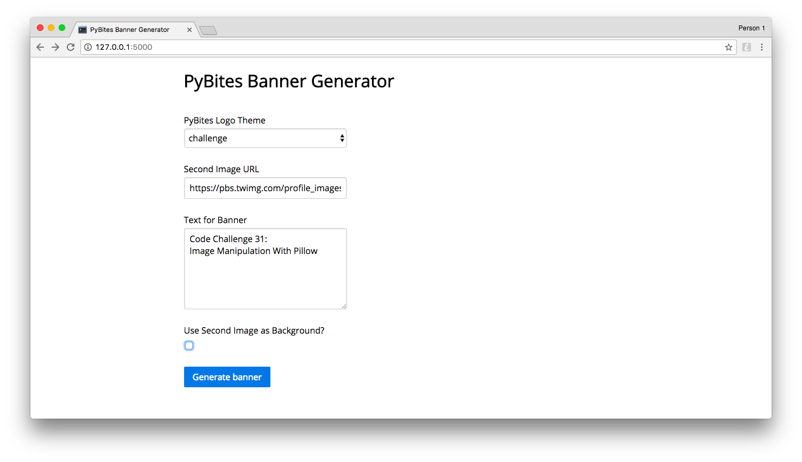
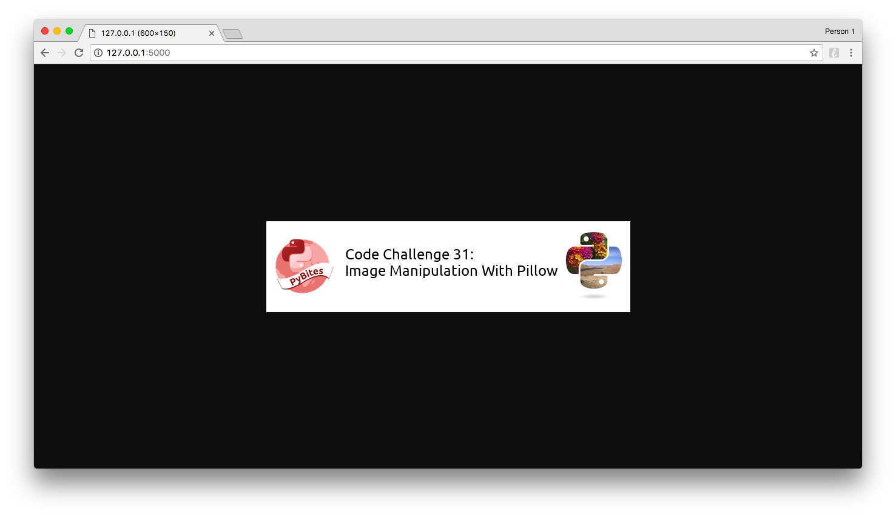
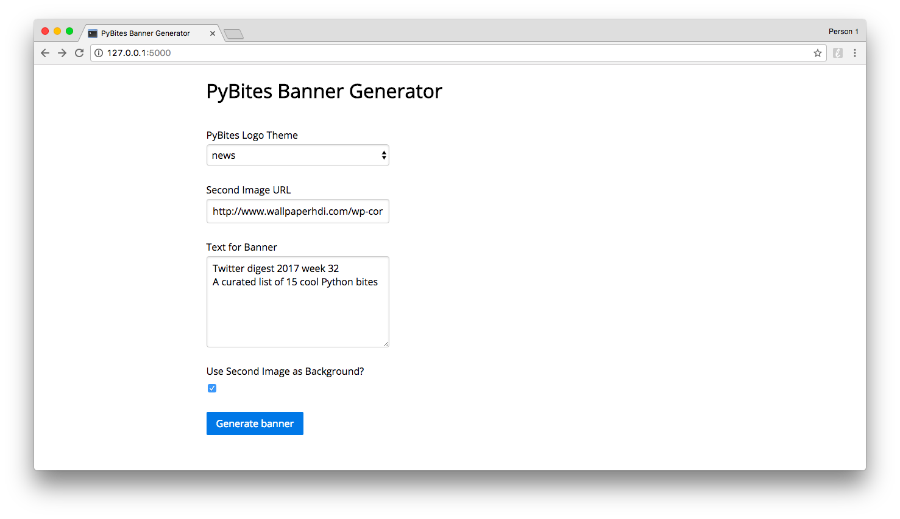
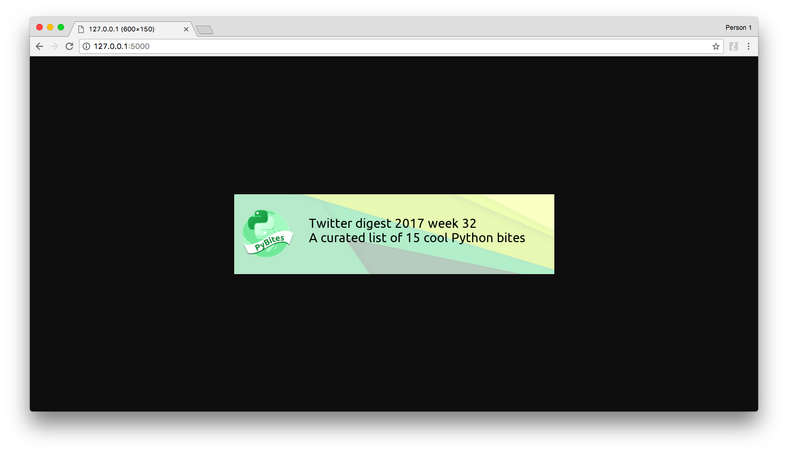

## PyBites Code Challenge 31 - Image Manipulation With Pillow

### Submission: PyBites Banner Generator

I made this utility to create quick but nice banners for PyBites Articles / Challenges / News / Special. However I think the code can easily be extended or modified to use it for your own needs.

It takes an existing PyBites logo as the first image, and downloads (caches) the second image. 

*Text for Banner* is for the text to be put on the banner. `SourceSansPro-Regular.otf` gave me a weird char for newline (`\n`) so I switched to `Ubuntu-R.ttf`. Of course you could build this out to also let the user choose the font type and more things. The underlying `banner.py` script should make this easy: all font settings are collected into a namedtuple before passing it to the image creating class.

The last option of the form controls the location of the second image titled *Use Second Image as Background?*. By default this is turned on and the second image serves as a background image (example 2). If you disable it, the image will be resized to thumbnail and aligned to the right (example 1 / as in [the article](https://pybit.es/pillow-banner-image.html)).

#### Example 1. - make a PyBites Code Challenge banner

1. Choose *challenge* as first image, provide URL to the second image, add banner text, disable *Use Second Image as Background?*:

	

2. Click *Generate banner*:

	

3. Right-click and save the image.

#### Example 2. - make a PyBites News banner

1. Choose *news* as first image, provide URL to the second image, add banner text, leave *Use Second Image as Background?* enabled:

	

2. Click *Generate banner*:

	

3. Right-click and save the image.

### PyBites articles:

* [Using Pillow to Create Nice Banners For Your Site](https://pybit.es/pillow-banner-image.html)

* This week I will write a part 2 how I wrapped the original `banner.py` (command line) script into this Flask app. If I don't get to update this readme, the previous article will link to it ...
