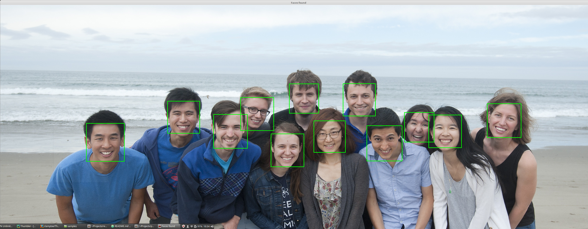
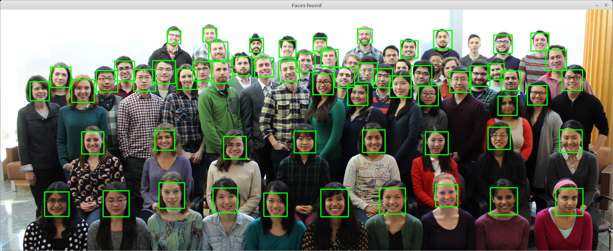
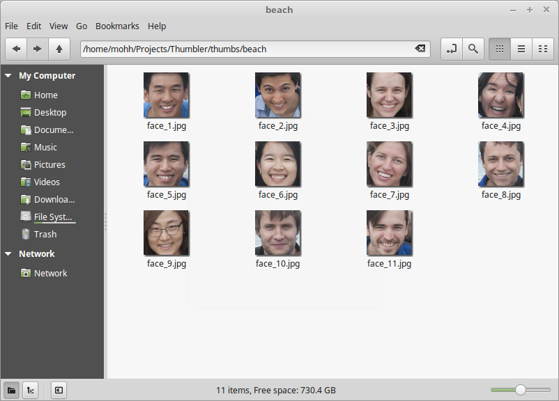

# Thumbler
> Proof of concept script that extracts faces as thumbnails from an image.

[![GitHub issues][issues-image]][issues-url]
[![GitHub forks][fork-image]][fork-url]
[![GitHub Stars][stars-image]][stars-url]
[![License][license-image]][license-url]
[![Twitter][twitter-image]][twitter-url]

## Installation
The most difficult thing to install was [OpenCV3](https://github.com/opencv/opencv.git). I've included an additional [document](opencv/OpenCV.md) on what I had to go through to get it working, hopefully it'll be of some use. I've also included a sample script so that you can test your installation. Both can be found in the *opencv* folder.

> DISCLAIMER: Now I must admit that I am using [Anaconda](https://www.continuum.io/) so the only hurdle I had with this was installing [OpenCV](https://github.com/opencv/opencv.git). Everything else was already installed. So the following has not been verified to work.

### Anaconda
> UPDATE: Recently I discovered an easier way to install OpenCV3 under Anaconda. If you are not using Anaconda, my write-up on OpenCV should be of some use. If you are using Anaconda, do the following:

If you just want to install it quickly use my Anaconda environment export:

```bash
conda env create -f conda_venv.yml
```

Otherwise, if you want to build it by hand, do the following:

This command will tell you how to install OpenCV3:
```bash
anaconda show menpo/opencv3
Using Anaconda API: https://api.anaconda.org
Name:    opencv3
Summary:
Access:  public
Package Types:  conda
Versions:
   + 3.1.0
   + 3.2.0

To install this package with conda run:
     conda install --channel https://conda.anaconda.org/menpo opencv3
```
Running that command will install it for you, but before you do that, I would recommend adding that channel to your list of channels.

```bash
conda config --append channels https://conda.anaconda.org/menpo
```
Now that you have that channel installed, all you have to do is create a new virtual environment with the modules that you need:

```bash
conda create --name thumbler python=3.6.2 opencv3 pillow
```
That command will create a new virtual environment called thumbler with Python 3.6.2 as the interpreter and install OpenCV3 and Pillow into it.

If done correctly, all of these packages will be installed as dependencies for those:

```bash
conda list
# packages in environment at /home/mohh/anaconda3/envs/thumbler:
#
freetype                  2.5.5                         2  
jbig                      2.1                           0  
jpeg                      9b                            0  
libpng                    1.6.27                        0  
libtiff                   4.0.6                         3  
mkl                       2017.0.3                      0  
numpy                     1.13.1                   py36_0  
olefile                   0.44                     py36_0  
opencv3                   3.1.0                    py36_0    menpo
openssl                   1.0.2l                        0  
pillow                    4.2.1                    py36_0  
pip                       9.0.1                    py36_1  
python                    3.6.2                         0  
readline                  6.2                           2  
setuptools                27.2.0                   py36_0  
sqlite                    3.13.0                        0  
tk                        8.5.18                        0  
wheel                     0.29.0                   py36_0  
xz                        5.2.2                         1  
zlib                      1.2.8                         3
```

### Normal Install
The usual will get you almost there:

```bash
cd [Your Projects Directory]
git clone https://github.com/clamytoe/Thumbler.git
cd Thumbler
python3.6 -m venv venv
source venv/bin/activate
pip install -r requirements
```
After this step, make sure to follow my instructions on installing OpenCV.

## Usage Example
The script is really simple to use. Initially I was going to put in the option to just scan a directory full of images and have it extract the faces, but since the HAAR profile that I'm using is only for frontal images, it's really picky. The size of the image seems to play a part on its results as well.

I've included some sample images that worked pretty good and also a few where some faces are not detected, just so that you can get a feel for how it works. I had to tweak the *scaleFactor* settings in some cases in order to NOT detect phantom faces.

```bash
python thumbler.py samples/beach.jpeg
Found 12 faces!
```
> All faces detected


```bash
python thumbler.py samples/mirkin.jpeg
Found 60 faces!
```
> Not all faces detected


## Saved Thumbnails
By default I'm having the extracted thumbnails saved into the Thumbler directory under **thumbs**. In that directory, a new directory is created for each image, based on the name of the image itself. So for the last two runs, my thumbs folder would look like this:

```bash
thumbs
├── beach
│   ├── face_0.jpg
│   ├── face_10.jpg
│   ├── face_11.jpg
│   ├── face_1.jpg
│   ├── face_2.jpg
│   ├── face_3.jpg
│   ├── face_4.jpg
│   ├── face_5.jpg
│   ├── face_6.jpg
│   ├── face_7.jpg
│   ├── face_8.jpg
│   └── face_9.jpg
└── mirkin
    ├── face_0.jpg
    ├── face_10.jpg
    ├── face_11.jpg
    ├── face_12.jpg
    ├── face_13.jpg
    ├── face_14.jpg
    ├── face_15.jpg
    ├── face_16.jpg
    ├── face_17.jpg
    ├── face_18.jpg
    ├── face_19.jpg
    ...

2 directories, 72 files
```

Here's a sample of the beach thumbnails:



## Credit
Most of the credit for this goes to [Real Python](https://realpython.com) for their [Face Recognition with Python, in under 25 lines of code](https://realpython.com/blog/python/face-recognition-with-python/) blog post!

## Release History
* 0.0.1
    * Proof of concept

## Meta

Martin Uribe – [@mohhinder](https://twitter.com/mohhinder) – clamytoe@gmail.com

Distributed under the MIT license. See ``LICENSE`` for more information.

[https://github.com/clamytoe/Thumbler](https://github.com/clamytoe/Thumbler)

[issues-image]:https://img.shields.io/github/issues/clamytoe/Thumbler.svg
[issues-url]:https://github.com/clamytoe/Thumbler/issues
[fork-image]:https://img.shields.io/github/forks/clamytoe/Thumbler.svg
[fork-url]:https://github.com/clamytoe/Thumbler/network
[stars-image]:https://img.shields.io/github/stars/clamytoe/Thumbler.svg
[stars-url]:https://github.com/clamytoe/Thumbler/stargazers
[license-image]:https://img.shields.io/badge/license-MIT-blue.svg
[license-url]:https://raw.githubusercontent.com/clamytoe/Thumbler/master/LICENSE
[twitter-image]:https://img.shields.io/twitter/url/https/github.com/clamytoe/Thumbler.svg?style=social
[twitter-url]:https://twitter.com/intent/tweet?text=Wow:&url=%5Bobject%20Object%5D
