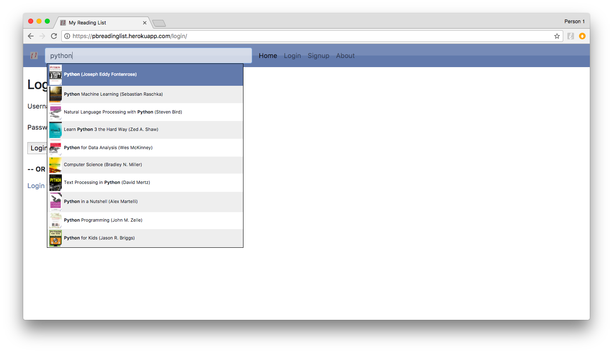
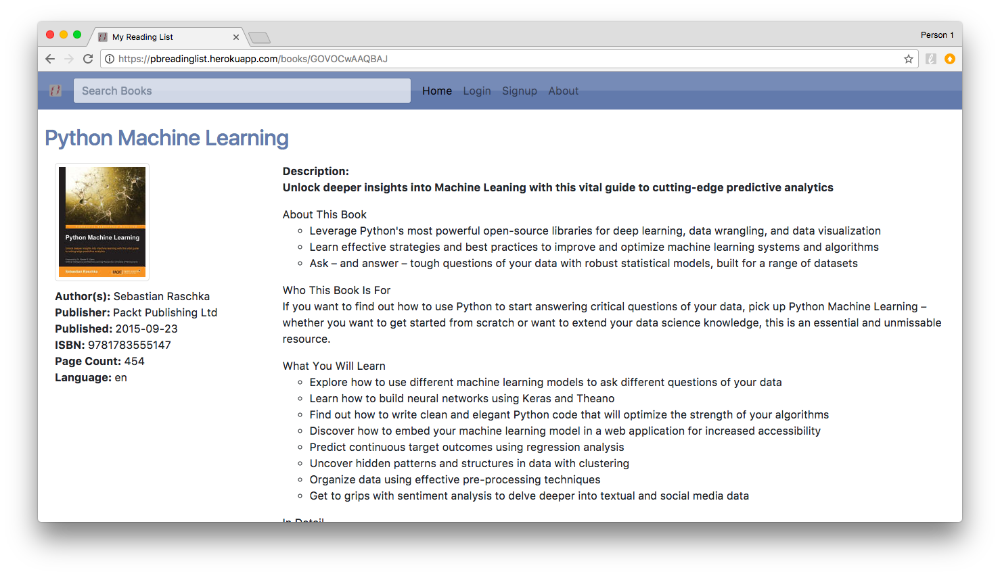
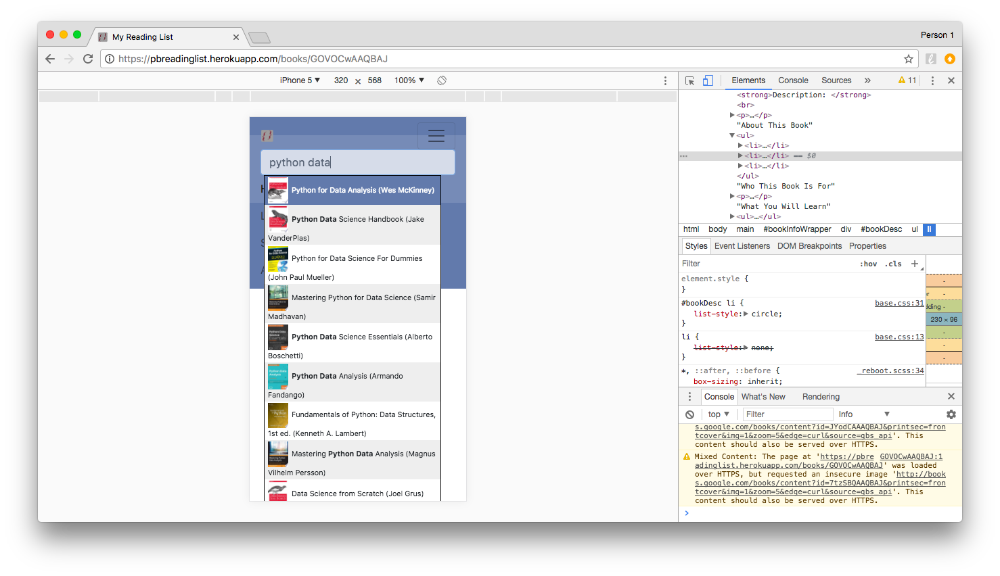
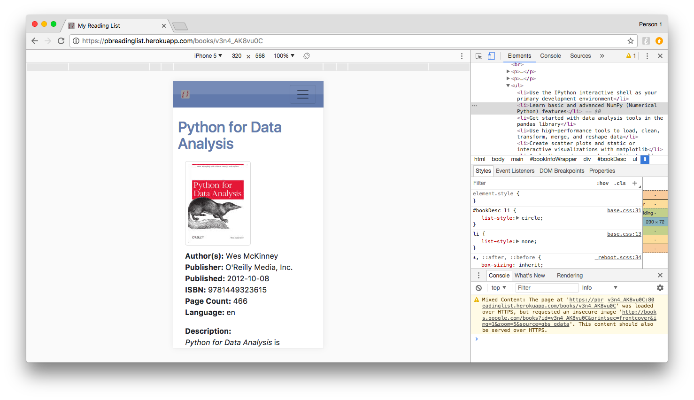
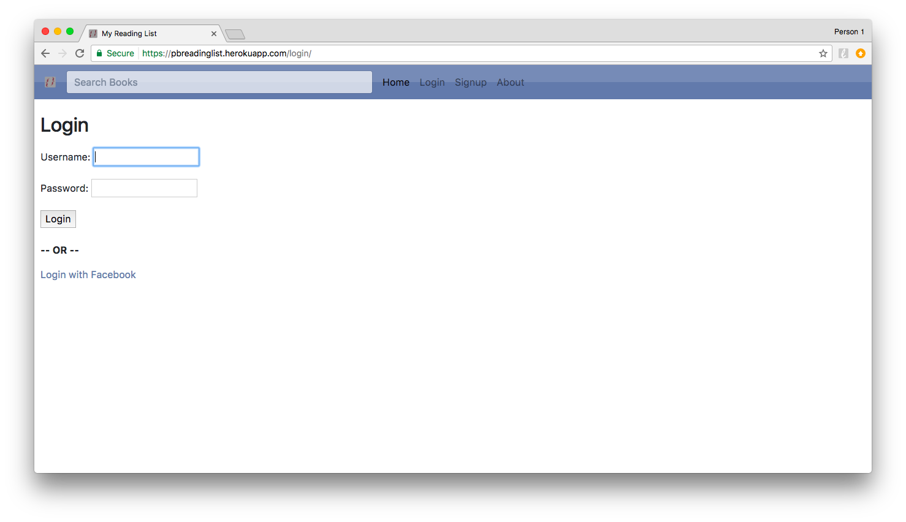
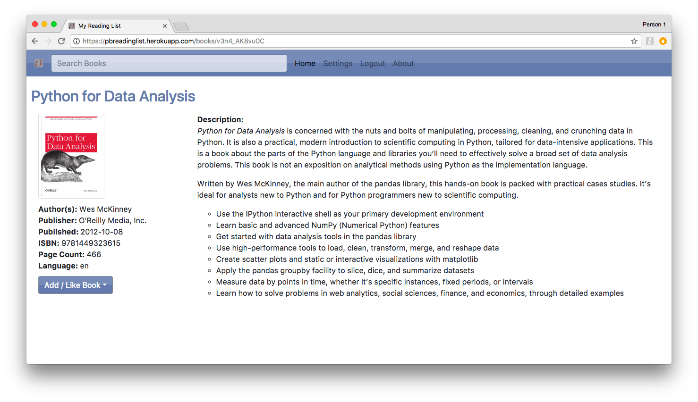

## PyBites Reading List

Meta: 

* Challenge: [#33 - Build a Django Tracker, Weather or Review App](https://pybit.es/codechallenge33.html).

* Original app: [fbreadinglist](http://fbreadinglist.com/) 

* New app (work in progress): [pbreadinglist](https://pbreadinglist.herokuapp.com)

The work so far was heavy on JS and design, but got the basics down to now expand Django back-end starting with user lists / reviews ...

* Ported autocomplete:

	

* Bootstrap css to have nice fluid layout:

	

* It works nice on mobile: 

	

* Another book:

	

* Special thanks to [Simpleisbetterthancomplex](https://simpleisbetterthancomplex.com) -> [How to Add Social Login to Django](https://simpleisbetterthancomplex.com/tutorial/2016/10/24/how-to-add-social-login-to-django.html) which helped bootstrapping this app:

	

* Logged in gives you queue / like feature (currently building)

	
