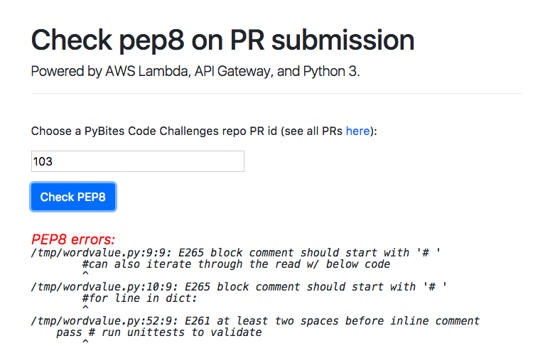
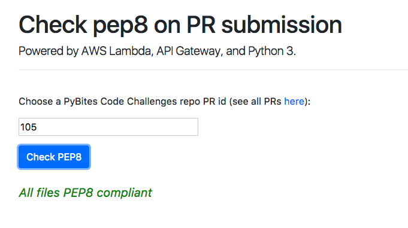

## AWS Lambda

Submission for [Code Challenge 36 - Create an AWS Lambda Function](https://pybit.es/codechallenge36.html). Thanks to Real Python for [this excellent beginner tutorial](https://realpython.com/blog/python/code-evaluation-with-aws-lambda-and-api-gateway/).

### What it does

As per Real Python's article I set up my Lambda function to receive payload via API Gateway. The lambda retrieves `prid` via a POST request and reaches out to GH API to retrieve the py files. It stores them in /tmp and runs PEP8 on them. It returns `ok` or `results` output upon any violations.

* Submission with some PEP violations:

	

* This PR was OK:

	

### Deploy

* I created a new repo for convenience, the code is [here](https://github.com/bbelderbos/first-aws-lambda).

* There is one dependency, the pep8 module, to deploy to AWS, make a zip file of `pep_lambda.py` and `pep8.py` and upload it in AWS Lambda generator GUI. To verify locally run `verify_pep_lambda.py`.

### TODOs

* Add a webhook for our Challenges repo
* Run unittests upon detection of test_*py files
* Build out to CI and write an article
