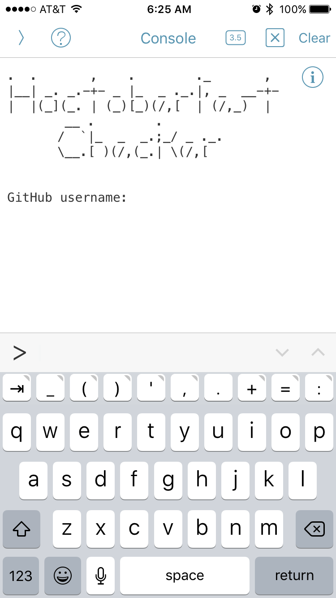
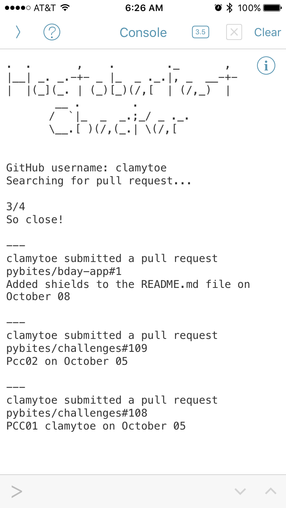

# PCC31 - Hacktoberfest Checker

> My Pybites challenge 31 entry for a Hacktoberfest Checker.

[![GitHub issues][git-issues-image]][git-issues-url]
[![GitHub forks][git-forks-image]][git-forks-url]
[![GitHub stars][git-stars-image]][git-stars-url]
[![License][license-image]][license-url]
[![Twitter][twitter-image]][twitter-url]

Since my kids have taken over my laptop to play games on [Steam](http://store.steampowered.com/), I have had very little time to code on it. I really wanted to give this challenge a try, so I started playing around on my *iPhone* with [Pythonista](https://itunes.apple.com/us/app/pythonista-3/id1085978097?mt=8).

I wrote the script so that it would run on either *Python 2.7* or *3*. The only requirement being that you have to install **Requests**.

## How to run

#### Pythonista 3

Just copy the code from the repo. Create a new *Empty Script* and give it a name. Then simply paste the code into it and run it.

That's it. Everything you need is already installed in the app.

#### OS X & Linux:

```bash
cd
mkdir Projects
cd Projects
git clone https://github.com/clamytoe/htfc.git
cd htfc
python3.6 -m venv venv
source ./venv/bin/activate
pip install -r requirements.txt
```

## Uninstall

Removing the files is very simple, just delete the folder where you cloned the repo to.

## Usage example

This script is really simple to use:

```bash
python htfc.py
```

From within *Pythonista* you just select the file and press on the *run* button.



Just enter your name and press return to get your results.



## Meta

Martin Uribe – [@mohhinder](https://twitter.com/mohhinder) – clamytoe@gmail.com

Distributed under the MIT license. See ``LICENSE`` for more information.

[git-issues-image]: https://img.shields.io/github/issues/clamytoe/htfc.svg
[git-issues-url]: https://github.com/clamytoe/htfc/issues
[git-forks-image]: https://img.shields.io/github/forks/clamytoe/htfc.svg
[git-forks-url]: https://github.com/clamytoe/htfc/network
[git-stars-image]: https://img.shields.io/github/stars/clamytoe/htfc.svg
[git-stars-url]: https://github.com/clamytoe/htfc/stargazers
[license-image]: https://img.shields.io/badge/license-MIT-blue.svg
[license-url]: https://raw.githubusercontent.com/clamytoe/pyTrack/master/LICENSE
[twitter-image]: https://img.shields.io/twitter/url/https/github.com/clamytoe/htfc.svg?style=social
[twitter-url]: https://twitter.com/intent/tweet?text=Wow:&url=%5Bobject%20Object%5D
