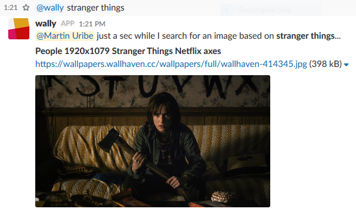

# mohhsbot (wally)
> Small Slack bot that will get you a random desktop wallpaper based on your search pattern.

[![GitHub issues][issues-image]][issues-url]
[![GitHub forks][fork-image]][fork-url]
[![GitHub Stars][stars-image]][stars-url]
[![License][license-image]][license-url]
![Python version][python-version]

This is a **Python 3.6** script that I wrote using [Anaconda](https://anaconda.org/) but you should have no problem running it in just a Python installation. This is loosely based on my *bash* implementation of [randPic](https://github.com/clamytoe/randPic).

## Anaconda Installation
```bash
cd Documents\Projects\
git clone https://github.com/clamytoe/MohhsBot.git
cd MohhsBot
conda env create -f environment.yml
```

## Regular Installation
```bash
cd Documents/Projects/
git clone https://github.com/clamytoe/MohhsBot.git
cd MohhsBot
python -m venv venv
source ./venv/bin/activate
pip install -r requirements.txt
```

## Configuration
I played around with two different ways of storing the bot keys. One way was to use environment variables, the other was to create a keys.py file. That one looks like this:
```python
BOT_ID = 'U854JKLNS'
BOT_NAME = 'mohh'
CHANNEL_ID = '...'
SLACK_BOT_TOKEN = '...'
```
I'll leave it up to you to figure out how to use environment variables if you want to go that route.
>**NOTE:** Only the *BOT_ID*, *SLACK_BOT_TOKEN* are needed for the script to work. The others are used during testing...

## Testing
I started this project with some test driven development (TDD), but I quickly reached the limits of my [PyTest](https://docs.pytest.org/en/latest/) knowledge when it came time to testing the Slack code. Currently it only tests the local code and establishing the connection.

To run the provided tests, simple run the following command:

```bash
(mohhsbot): pytest
============================= test session starts =============================
platform win32 -- Python 3.6.3, pytest-3.2.5, py-1.5.2, pluggy-0.4.0 -- C:\Users\clamytoe\virtualenvs\mohhsbot\Scripts\python.exe
cachedir: .cache
rootdir: C:\Users\clamytoe\Documents\Projects\MohhsBot, inifile:
collecting ... collected 3 items
test_mohhsbot.py::test_environment_variables PASSED
test_mohhsbot.py::test_slack_connection PASSED
test_mohhsbot.py::test_bot_id PASSED

========================== 3 passed in 0.55 seconds ===========================
Process finished with exit code 0
```

## Getting your bot's ID
I've provided a little script that should help you get the ID of your bot. If you are not getting the ID, uncomment the *print()* statement to help you find it.

```bash
(mohhsbot): python get_bot_id.py
Bot ID for "mohh" is U854JKLNS
```

## Running the bot
Once you have everything configured and you can run the initial test successfully, you should be ready to run the bot. Start it like so:

```bash
(mohhsbot): python mohhsbot.py
Bot connected and running!
```

## Using the bot on Slack
Make sure to add the bot to one of your channels in order to have it response to image search commands. Here is a sample run:



[issues-image]:https://img.shields.io/github/issues/clamytoe/MohhsBot.svg
[issues-url]:https://github.com/clamytoe/MohhsBot/issues
[fork-image]:https://img.shields.io/github/forks/clamytoe/MohhsBot.svg
[fork-url]:https://github.com/clamytoe/MohhsBot/network
[stars-image]:https://img.shields.io/github/stars/clamytoe/MohhsBot.svg
[stars-url]:https://github.com/clamytoe/MohhsBot/stargazers
[license-image]:https://img.shields.io/github/license/clamytoe/MohhsBot.svg
[license-url]:https://github.com/clamytoe/MohhsBot/blob/master/LICENSE
[python-version]:https://img.shields.io/badge/python-3.6%2B-brightgreen.svg
