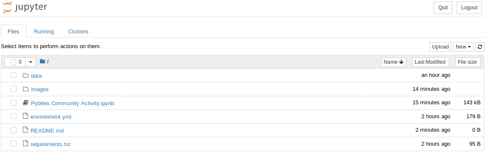
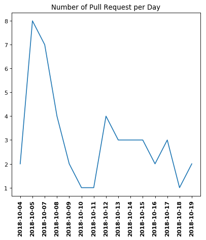
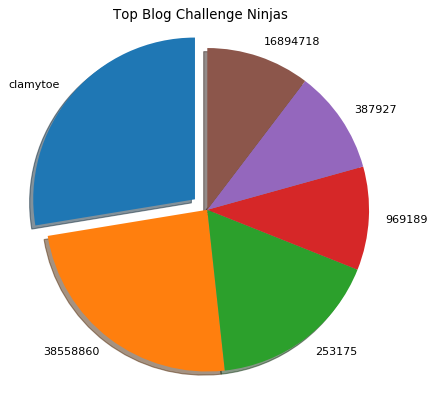
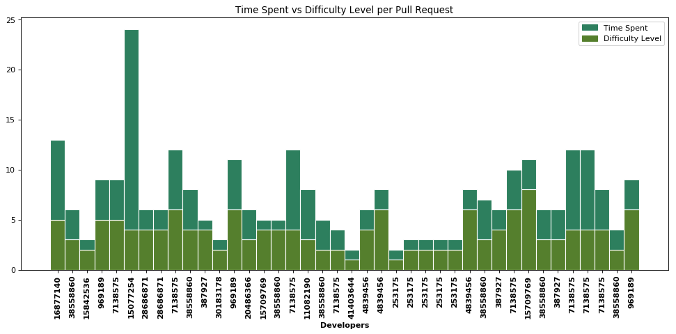

# Pybites Community Branch Activity
> Small write-up on how I explored some of the data that I collected from Github's API.
---
I wanted to play around with a dataset and see what I could find out about it. I decided on analyzing the little bit of data that I could collect from Github without having to use an OAuth key, which limits it to just 300 events. To follow along you will need to do the following steps:

1. Create a virtual environment and install the necessary packages
2. Fire up Jupyter notebooks
3. Execute the cells in the notebook

## Creating a virtual environment and installing packages
There are many ways to do this and it's beyond the scope of this write-up. If you are using Anaconda though, the following command will create the virtual environment and install the needed packages for you.

### Anaconda
```zsh
conda create .
```

### Others
For the rest of you, after you've created your virtual environment with your prefered method, the following will install the needed requirements:
```zsh
pip install -f requirements.txt
```

## Starting up the Jupyter notebook
Once you've gotten everything setup and you've activated your environment, you're ready to proceed. Jupyter notebook can be started with the following command once you've navigated to the location wheere you've saved the notebook file to.
```zsh
jupyter notebook
```
Your default browser should automatically open and should look like this:


## Open the Notebook
Simply click on **Pybites Community Activity.ipynb** to start it up.


## To run all of the cells
You have the option of running each of the cells one at a time or you can just run them all in sequential order. Selecting a cell and either clicking on the **Run** button on the menu or using the key combination **Shift+Enter** will run the code in that cell if its code.

To run them all you will have to use the menu: ***Cell > Run All***

## Visualization of the data
I go into further detail in the notebook, but here are a few of the graphs that I created with the help of [The Python Graph Gallery](https://python-graph-gallery.com/):

### Number of Pull Requests per Day


### Top Blog Challenge Ninjas


### Time vs Difficulty Level per Pull Request

