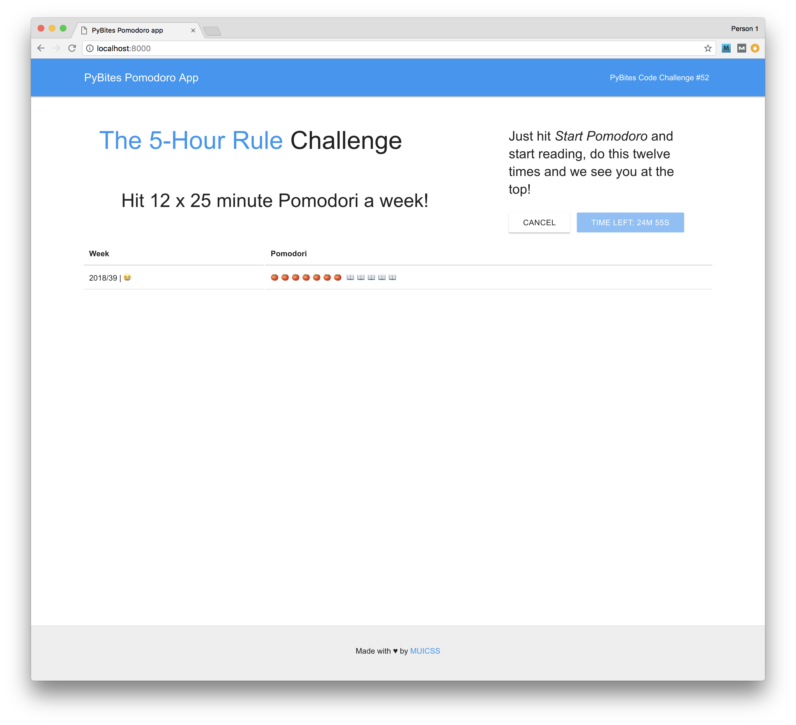

# PyBites Code Challenge 52 - Create your own Pomodoro Timer

## The 5-Hour Rule Challenge

### Hit 12 x 25 minute Pomodori a week!

A Django app to keep track of your reading Pomodori. It matches against the wise target of 12 pomodori (= 12 x 25 = 300 min = 5 hours) per week, as per the [The 5-Hour Rule Challenge](https://www.entrepreneur.com/article/317602). TODO: implement this app on [our reading list app](http://pbreadinglist.herokuapp.com/).

