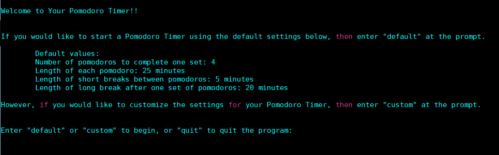
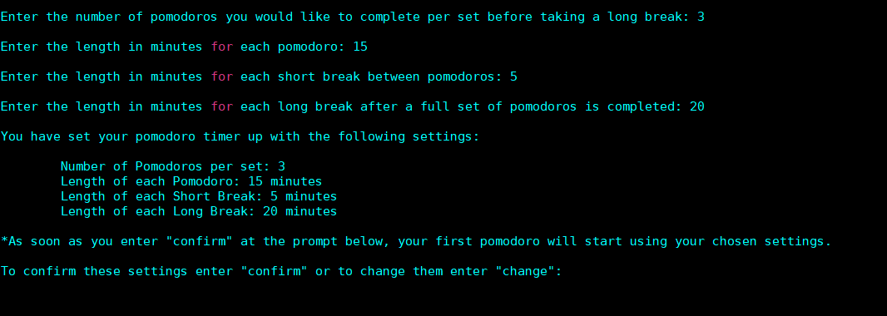
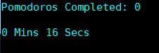
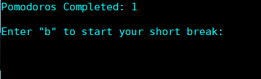
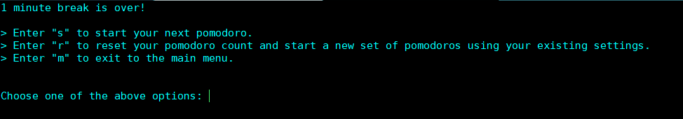

# Pomodoro Timer
> Just a simple, but interactive, Linux CLI-based Pomodoro Timer.

## Requirements
1. Python 3.6 or higher

## How To Use
I am still continuing to develop this timer, so until further updates, you can simply either clone this repo or just download the single **pomodoro.py** file and run the script on the CLI using Python 3.6 or higher.

### Cloning the Repo
1. Create and then change into the directory you would like to clone the repo into.
   - `mkdir <directory name>`
   - `cd <directory name>`
   - Use one of the two following methods:
     - `git clone https://github.com/cod3ghoul/pomodoro.git` (to use HTTPS)
     - `git clone git@github.com:cod3ghoul/pomodoro.git` (to use SSH)
   - `cd pomodoro`

### Then just run the script using Python 3.6+
`python3.6 pomodoro.py`

## Example Usage
- This is the main menu when you first run the script. As you can see, you have the option to choose to go with the **default** settings shown; enter the **custom** settings menu and define your own timers, to include the number of pomodoros you would like to complete before taking a long break; or type **quit** to exit the program.
- If you choose **default**, as soon as you hit *Enter* your first timer will begin.
- **NOTE**: You do have to enter *default*, *custom*, or *quit* exactly (case in-sensitive) or you will just get an error message and then be sent back to this main menu.

- If you choose **custom** from the main menu, you will be prompted for the settings you would like, so you can customize your set of pomodoros and length of breaks.
- Below is a screenshot of what will be displayed after you finish entering all your setting options.
- You will be asked to either **confirm** your settings, at which point when you hit *Enter* your first timer will start. Or you can enter **change** if you'd like to change them.

- Once a pomodoro timer begins, the display will show you how many pomodoros you have completed so far, and of course the timer itself.

- After the timer ends for each of your pomodoros, **before you complete one full set**, you will be prompted to enter **b** to start the timer for your short break.

- At the end of each break you will be given the options displayed below. Choosing **m** will take you back to the main menu and reset your pomodoro count. At the main menu you can once again either **quit** the program or choose to start a fresh set of pomodoros using different custom settings, or this time go with the defaults.

