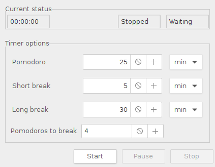

# wxPomodoro

Simple [pomodoro](https://en.wikipedia.org/wiki/Pomodoro_Technique) timer based on wxPython Phoenix GUI.

### Features
* Simple GUI to configure timer options
* Desktop notifications via `libnotify`
* Tray icon with current timer status

### TODO
* IPC to manipulate this app with custom scripts (from i3wm, for example)
