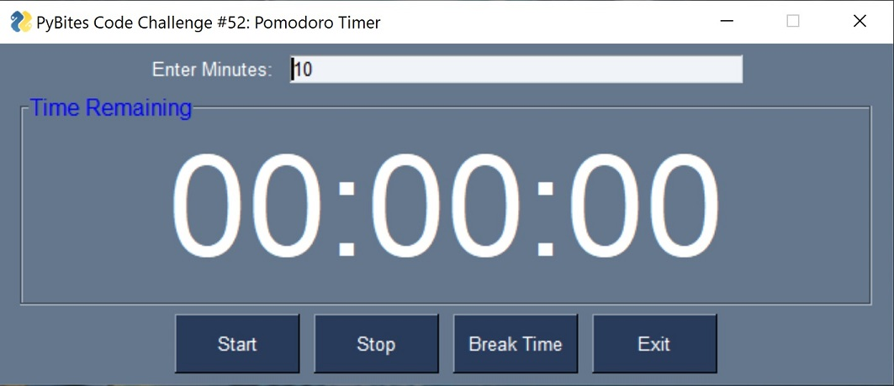
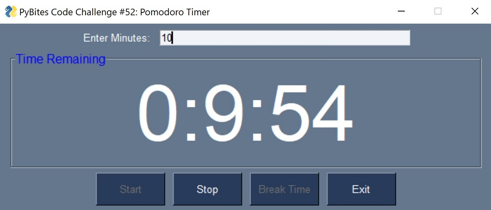

# Python Pomodoro
A "pomodoro" timer written in python and using the PySimpleGUI package to create a simply layout.

## PyBites Challenge
Please visit [PyBites Challenge](https://codechalleng.es/challenges/52/) for more information.

## Required Packages
PySimpleGUI - See the official documentation [here](https://pysimplegui.readthedocs.io/en/latest/)

## Screenshots

