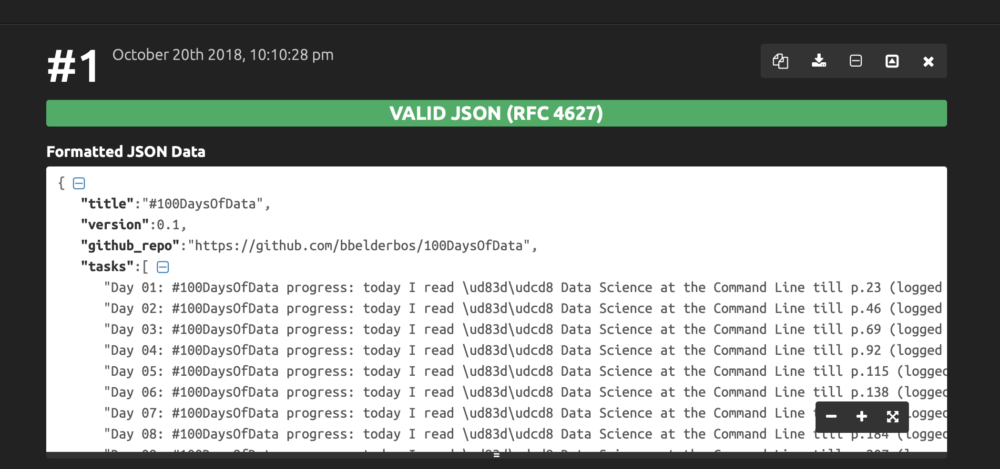

# #100DaysOfCode Reading Planner

This script splits x books over y pages per day over the course of 100 consecutive days. 

Just provide the bookids as retrieved from [our reading list](http://pbreadinglist.herokuapp.com/), 4 or 5 is the sweet spot I think.

For example for my upcoming 100 Days of Data I plan to read the following books:

		$ python curriculum.py EsWeBAAAQBAJ JYodCAAAQBAJ vbQlDQAAQBAJ eBSgoAEACAAJ bRpYDgAAQBAJ

This gives [this JSON output][out.json] which [validates fine](https://jsonformatter.curiousconcept.com) (\ud83d\udcd8 is a book emoji, let's see if it shows up on our Grid ...)

 
