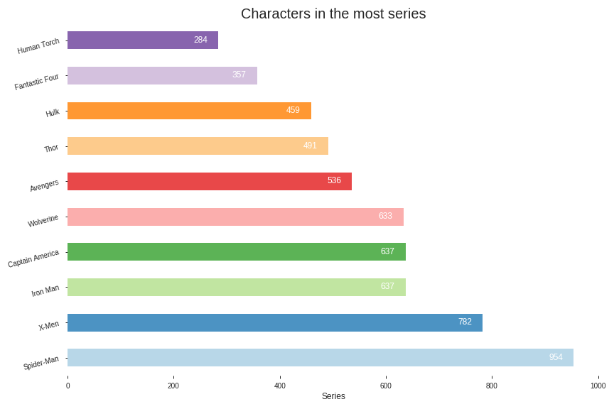
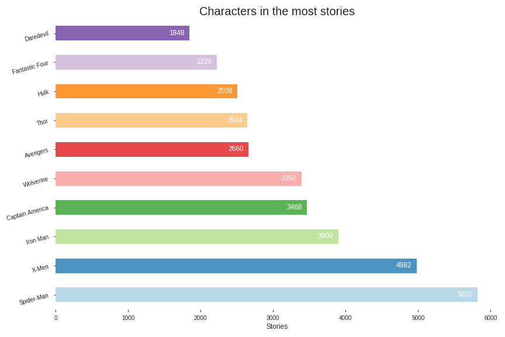

# Marvel Comics Data Exploration

Starting out, I wasn't sure how to approach this challenge, so I decided to get all of the data from the [Marvel API](https://developer.marvel.com/). My Internet connection at home is terrible, so it took me several days of wrangling with it to finally get through most of it.

I had to deal with network drops, server issues, and hitting the max recursion limit for Python in order to get what I did. I finally decided that I had enough and started to explore what I had. Nothing really stood out to me, so I decided to concentrate on the creators and came up with these graphs.

## Most prolific people in comics

They depict the top five of their fields based on how many comics they worked on for those particular roles:

### Artists

### Colorist

### Editors

### Inkers

### Letterers

### Painters

### Pencillers

### Writers

## Most used roles

Here I decided to try and show which roles are the ones that are used the most in creating comics.

---

## Character stats
In this section I concentrated on the characters themselves. Based on the data available from the dataset, I extracted the top 10 characters from each of the following categories:

### Comics

### Events

### Series

### Stories

