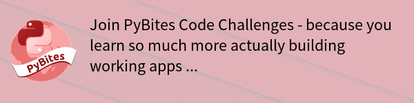

# PyBites Code Challenges

Every Tuesday we release [a new code challenge](https://pybit.es/pages/challenges.html). Next Monday we publish submissions that have been PR'd. 

Follow [these instructions](https://github.com/pybites/challenges/blob/master/INSTALL.md) to get coding.

To receive a weekly email notification [subscribe here](https://pybites-notifier.herokuapp.com).

Remember, we don't strive for the 'best' solution, it's not a competition.  Learning more + better Python is the main objective. Respect the newbie.

We believe solving code challenges is a very effective way to achieve this. Good luck and have fun!

---

Keep Calm and Code in Python!

Bob and Julian @ [PyBites](http://pybit.es)
